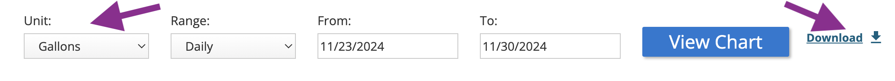

# 💧 Water Table 🚰

The [Philadelphia Water Department](https://water.phila.gov/) website
allows for a residential account holder to download an export of their water usage
in "comma-separated values" (CSV) file format.

---

## Export

A CSV can be downloaded by "Gallons" of water used "Daily" from the
"[Detailed Usage](https://secure8.i-doxs.net/CityOfPhiladelphiaWRB/Secure/Usage.aspx)"
section of the Philadelphia Water Department (PWD) website.



The default export file is named "`ChartData.csv`", containing data such as
the following:
```
Access Code, Time Interval, Consumption, Units
00145xxxx, 11/27/2024, 18.7013, Gallons
00145xxxx, 11/28/2024, 35.9065, Gallons
00145xxxx, 11/29/2024, 35.1584, Gallons
00145xxxx, 11/30/2024, 44.8831, Gallons
00145xxxx, 12/01/2024, 71.8130, Gallons
00145xxxx, 12/02/2024, 25.4338, Gallons
00145xxxx, 12/03/2024, 23.9377, Gallons
etc..
```
Only the second and third columns of this CSV file truly matter, since the first
column seems to be associated to the PWD account, while the fourth column value
should always be " ` Gallons`".

## Import
With a `ChartData.csv` file from PWD, the Django management command `fill`
is used to import records into the Django database from the `.CSV` file data:
```
(venv) ➜ eric@pro:~/code/watertable git:(main) ✗ $ python3 manage.py fill
Created:        Wednesday, November 27, 2024 (2024-11-27) [18.7013 gallons]
Created:        Thursday, November 28, 2024 (2024-11-28) [35.9065 gallons]
Created:        Friday, November 29, 2024 (2024-11-29) [35.1584 gallons]
Created:        Saturday, November 30, 2024 (2024-11-30) [44.8831 gallons]
Created:        Sunday, December 01, 2024 (2024-12-01) [71.813 gallons]
Created:        Monday, December 02, 2024 (2024-12-02) [25.4338 gallons]
Created:        Tuesday, December 03, 2024 (2024-12-03) [23.9377 gallons]
Total:          7
Done.
```

---

### Software
The main page (`/`) uses DataTables, while `/chart/` uses HighCharts.

Both DataTables and HighCharts depend upon identical JSON data from the same
Django REST framework API location:

`/api/usage/?format=json`

### Refreshing Data
Finally, downloading a fresh `ChartData.csv` file from the Philadelphia Water
Department website, and running `manage.py fill` again will update, or create,
any water usage records for the appropriate days.

It appears that the Philadelphia Water Department website may only preserve
approximately two (2) years of historical water usage.

---

## Examples

### DataTables
- https://water.ericoc.com/

### HighCharts
- https://water.ericoc.com/chart/

### Django REST framework API
- https://water.ericoc.com/api/usage/
